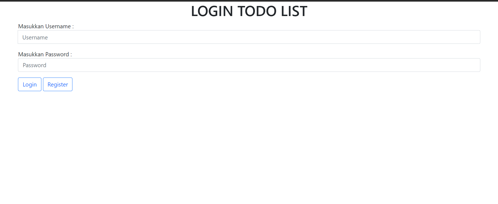

# To Do Livarchar(36)t APP with CodeIgniter
### Database Table
#### user
| username      | password_hash |
| ------------- | ------------- |
| varchar(36)_PK   | varchar(60)   |

#### todolist
| idkegiatan      | kegiatan | status      | username | tanggal |
| - | - | - | - | - 
| int(5)_PK(INCREMENT) | varchar(36) | tinyint(1) | varchar(36) | date

