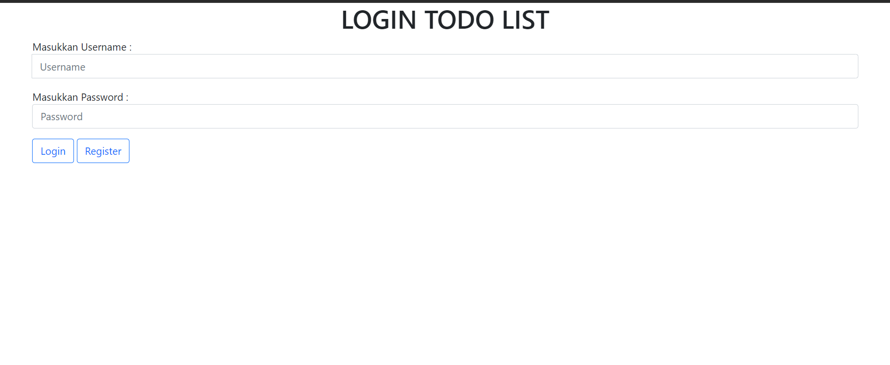
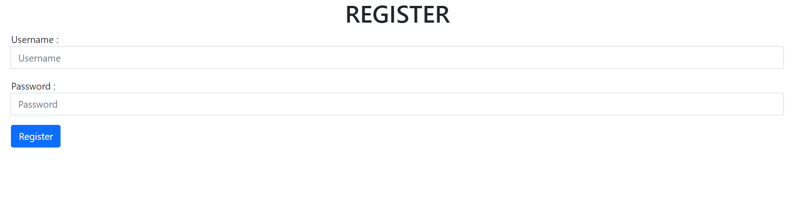
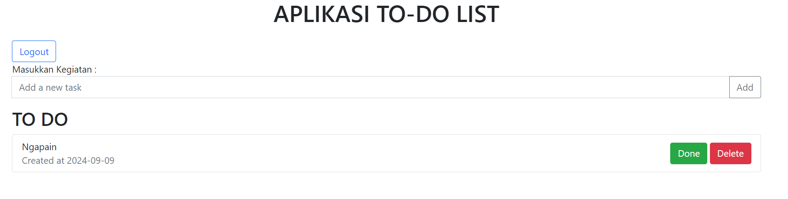

# To Do List Web APP with CodeIgniter
### Database Table
#### user
| username      | password_hash |
| ------------- | ------------- |
| varchar(36)_PK   | varchar(60)   |

#### todolist
| idkegiatan      | kegiatan | status      | username | tanggal |
| - | - | - | - | - 
| int(5)_PK(INCREMENT) | varchar(36) | tinyint(1) | varchar(36) | date

## To Run
type "php spark serve" in terminal without the quotation

## Preview
### Login View
- textfields for the username and password inputs
- the "login" button will create a session based on the username if username exists
- the "register" button will redirect user to the register view

### Register View
- textfields for the username and password inputs
- the "register" button will create and save the username and password from the inputs

### To Do List
- the "Add" button adds an item based on the textfield to the to the list
- the "Done" button marks an item as done and will hide the item from the list
- the "Delete" button deletes the item from the list
- the "Logout" button destroys the session and will log the user out
